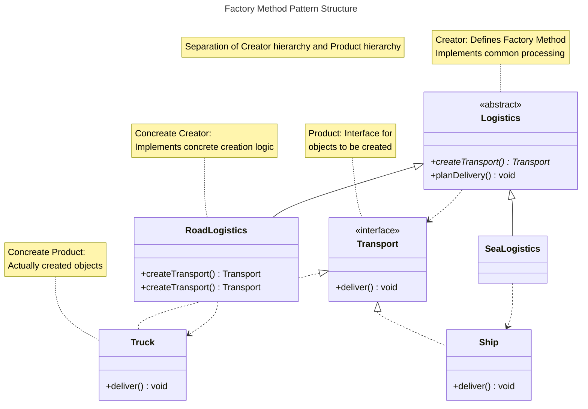

# What is the Factory Method Pattern?

The Factory Method Pattern is a creational pattern that defines an interface for creating objects,
but lets subclasses decide which class to instantiate.

The parent class defines the interface for creation, while concrete creation logic is determined by subclasses.

This achieves extensibility that allows adding new classes without modifying code, adhering to the Open-Closed Principle.

## Why is Factory Method Needed?

Consider the following situation:

> We are developing a logistics management system that currently only supports road transportation. We may add sea and air transportation in the future. We don't want to modify existing code every time a new transportation method is added.

This problem occurs in various scenarios such as adding payment methods, switching log output destinations, and selecting database drivers.

### Problematic Code

With Simple Factory implementation, the Factory needs modification every time a new class is added.

```typescript
interface Transport {
  deliver(): void;
}

class Truck implements Transport {
  deliver() {
    console.log("Delivering by road")
  }
}

class Ship implements Transport {
  deliver() {
    console.log("Delivering by sea")
  }
}

// Simple Factory: requires modification for each new transportation method
class TransportFactory {
  static create(type: string): Transport {
    switch (type) {
      case "road":
        return new Truck();
      case "sea":
        return new Ship();

      // Need to modify here to add air transportation

      default:
        throw new Error(`Unknown type: ${type}`);
    }
  }
}
```

This example has the following problems:

- Need to modify `TransportFactory` every time a new transportation method is added
- Violates Open-Closed Principle (not open for extension)
- Difficult to replace specific transportation methods with mocks during testing

### Solution with Factory Method Pattern

Delegate creation responsibility to subclasses.

```typescript
interface Transport {
  deliver(): void;
}

class Truck implements Transport {
  deliver() {
    console.log("Delivering by road")
  }
}

class Ship implements Transport {
  deliver() {
    console.log("Delivering by sea")
  }
}

// Creator: Define Factory Method
abstract class Logistics {
  // Factory Method: implemented by subclasses
  abstract createTransport(): Transport;

  // Template Method: logic using Factory
  planDelivery(): void {
    const transport = this.createTransport();

    console.log("配送を計画中...");
    transport.deliver();
    console.log("配送完了");
  }
}

// Concrete Creator: Road logistics
class RoadLogistics extends Logistics {
  createTransport(): Transport {
    return new Truck();
  }
}

// Concrete Creator: Sea logistics
class SeaLogistics extends Logistics {
  createTransport(): Transport {
    return new Ship();
  }
}

// Usage
const roadLogistics = new RoadLogistics();
roadLogistics.planDelivery();
// Output:
// Planning delivery...
// Delivering by road
// Delivering complete
```

This implementation provides the following improvements:

- When adding new transportation methods, just create new subclass without modifying existing code
- Adheres to Open-Closed Principle (open for extension, closed for modification)
- Each transportation method can be managed in independent classes
- Can replace subclasses with mocks during testing

### Pattern Structure




💡 **Essence**

The essence of the Factory Method Pattern is not about "creating objects."

It is **"delegating creation decision to subclasses, making the parent class extensible without modification."**

## Relationship with Template Method Pattern

Factory Method is often used in combination with **Template Method Pattern**.

```typescript
abstract class Logistics {
  // Factory Method
  abstract createTransport(): Transport;

  // Template Method: defines algorithm skeleton
  planDelivery(): void {
    console.log("1. Check inventory");

    const transport = this.createTransport(); // calls Factory Method

    console.log("2. Prepare cargo");
    transport.deliver();
    console.log("3. Record delivery completion");
  }
}
```

This combination allows Template Method to define the processing flow skeleton, while Factory Method delegates the variable part (object creation) to subclasses.

## When to Use It?


| Use Case | Reason |
| --- | --- |
| Different creation logic needed per subclass | Each subclass creates appropriate objects |
| Likely to add new types in the future | Extensible without modifying existing code |
| Framework wants to delegate creation to app | Library side only provides abstract class |
| Want to replace creation with mocks during testing | Can replace per subclass |

### Example: Document Export

```typescript
interface Formatter {
  format(document: Document): string;
}

abstract class DocumentExporter {
  abstract createFormatter(): Formatter;

  export(document: Document): string {
    const formatter = this.createFormatter();
    return formatter.format(document);
  }
}

class PDFExporter extends DocumentExporter {
  createFormatter(): Formatter {
    return new PDFFormatter();
  }
}

class MarkdownExporter extends DocumentExporter {
  createFormatter(): Formatter {
    return new MarkdownFormatter();
  }
}
```

## When NOT to Use It?

Using Factory Method for the following reasons is incorrect.

### Few creation targets with no growth expected

```typescript
// ❌ Excessive
abstract class ReportGenerator {
  abstract createReport(): Report;
}
```

No need to create complex inheritance hierarchy when options are fixed. Simple Factory suffices.

💡 Principle

Don't use Factory Method just on speculation that "it might grow in the future."

It's not too late to refactor from Simple Factory to Factory Method when actual extensibilirty need arises.

### Simple conditional branching suffices

```typescript
// ❌ Excessive
abstract class Logger {
  abstract createOutput(): Output;
}

// ✅ Recommended: Simple conditional or DI
class Logger {
  constructor(private output: Output) {}

  log(message: string): void {
    this.output.write(message);
  }
}
```

### Can be solved with Dependency Injection (DI)

```typescript
// ❌ Unnecessary
abstract class OrderService {
  abstract createPaymentProcessor(): PaymentProcessor;
}

// ✅ Recommended: inject via DI
class OrderService {
  constructor(private paymentProcessor: PaymentProcessor) {}

  processOrder(order: Order): void {
    this.paymentProcessor.process(order);
  }
}
```

DI benefits include no inheritance required, easy mock replacement during testing, and ability to inject different implementation at runtime.

## Considerations When Using Factory Method

When adopting Factory Method Pattern, understand the following three considerations.

### 1. Inheritance hierarchy becomes complex

Using Factory Method increases class count.

Simple Factory requires 4 classes (Factory + Interface + 2 Products), 
while Factory Method requires 6 classes (Creator + 2 Concrete Creators + Interface + 2 Products).

Balance the benefits of extensibility against the cost of complexity.

### 2. Duplicate code may occur per subclass count

When common processing duplicates across subclasses, extract common processing to parent class.

```typescript
// ✅ Extract common processing to parent class
abstract class Logistics {
  abstract createTransport(): Transport;

  planDelivery(): void {
    this.initialize(); // Common initialization

    const transport = this.createTransport();
    transport.deliver();
  }

  private initialize(): void {
    console.log("Loading settings");
    console.log("Establishing connection");
  }
}
```

### 3. Multiple Factory Methods signal design review

When a class has multiple Factory Method (e.g., `createEnemy()` and `createReward()`), it may be time to consider migrating to **Abstract Factory Pattern**.

## Summary

Factory Method Pattern is "a creational pattern that defines an interface for creating objects, but lets subclasses decide which class to instantiate."

💡 Key Points

- **Emphasize extensibility** - Adding new classes doesn't require modifying existing code
- **Adhere to Open-Closed Principle** - Open for extension, closed for modification
- **Understand inheritance hierarchy trade-offs** - Accept increased class count
- **Gradual migration from Simple Factory** - Simple Factory suffices initially, migrate when extensibility need arises

Always consider whether "extensibility is truly needed" and "can it be solved with DI or Strategy Pattern."
