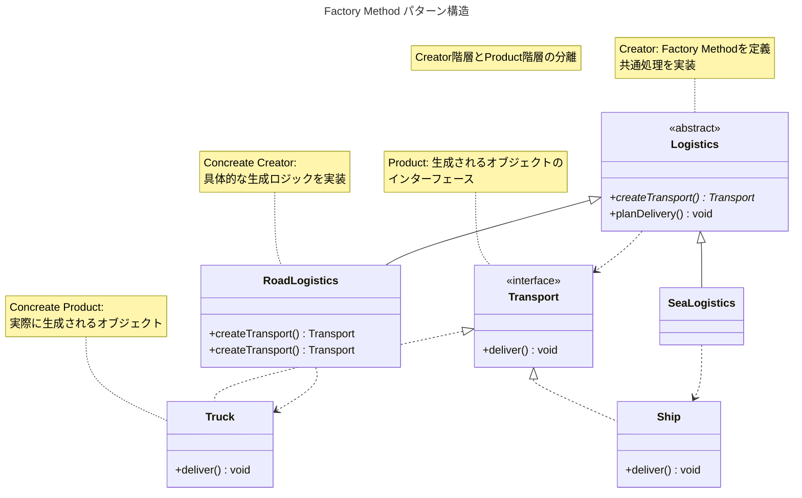

# Factory Methodパターンとは？

Factory Methodパターンはオブジェクトを生成するためのインターフェースを定義し、
どのクラスをインスタンス化するかはサブクラスに決定させる生成パターンです。

親クラスでオブジェクトを生成するインターフェースを定義し、具体的な生成ロジックはサブクラスが決定します。

これにより、コードを修正せずに新しいクラスを追加できる拡張性を実現しOpen-Closed原則に準拠します。

## なぜFactory Methodが必要なのか

次の様な状況を考えて見ます。

> 「配送管理システムを開発しているが、現在は陸路配送のみ対応。将来的に海路、空路配送を追加する可能性がある。配送方法が増える度に既存コードを修正したくない」

この問題は、決済方法の追加、ログ出力先の切り替え、データベースドライバーの選択など、様々な場面で発生します。

### 問題のあるコード

Simple Facotryを使った実装では、新しいクラスを追加する度にFactoryを修正する必要があります。

```typescript
interface Transport {
  deliver(): void;
}

class Truck implements Transport {
  deliver() {
    console.log("陸路で配送します")
  }
}

class Ship implements Transport {
  deliver() {
    console.log("海路で配送します")
  }
}

// Simple Factory: 新しい配送方法を追加する度に修正が必要
class TransportFactory {
  static create(type: string): Transport {
    switch (type) {
      case "road":
        return new Truck();
      case "sea":
        return new Ship();

      // 空路を追加する場合、ここを修正する必要がある

      default:
        throw new Error(`Unknown type: ${type}`);
    }
  }
}

// クライアントコード
class LogisticsManager {
  planDelivery(type: string) {
    const transport = TransportFactory.create(type);
    transport.deliver();
  }
}
```

この例では次の問題があります。

- 新しい配送を追加する度に `TransportFactory` を修正する必要がある
- Open-Closed原則に違反(拡張に対して開いていない)
- テスト時に特定の配送方法だけをモックに差し替えにくい

### Factory Methodパターンによる解決

サブクラスに生成の責務を委譲します。

```typescript
interface Transport {
  deliver(): void;
}

class Truck implements Transport {
  deliver() {
    console.log("陸路で配送します")
  }
}

class Ship implements Transport {
  deliver() {
    console.log("海路で配送します")
  }
}

// Creator: Factory Methodを定義
abstract class Logistics {
  // Factory Method: サブクラスが実践する
  abstract createTransport(): Transport;

  // Template Method: Factoryを使用するロジック
  planDelivery(): void {
    // 生成ロジックをサブクラスに委譲
    const transport = this.createTransport();

    // 共通の処理フロー
    console.log("配送を計画中...");
    transport.deliver();
    console.log("配送完了");
  }
}

// Concrete Creator: 陸路配送
class RoadLogistics extends Logistics {
  createTransport(): Transport {
    return new Truck();
  }
}

// Concrete Creator: 海路配送
class SeaLogistics extends Logistics {
  createTransport(): Transport {
    return new Ship();
  }
}

// 使用例
const roadLogistics = new RoadLogistics();
roadLogistics.planDelivery();
// Output:
// 配送を計画中...
// 陸路で配送します
// 配送完了
```

この実装では次のことが改善されます。

- 新しい配送方法を追加する際、新しいサブクラスを作るだけで既存コードを修正しない
- Open-Closed原則に準拠（拡張に対して開き、修正に対して閉じる）
- 各配送方法ごとに独立したクラスで管理できる
- テスト時にサブクラス単位でモックに差し替えられる

### パターンの構造

Factory Methodパターンの基本構造を図で確認しましょう。




💡 **本質**

Factory Methodパターンの本質は「オブジェクトを作る」ことではありません。

「生成の決定権をサブクラスに委譲し、親クラスを修正せずに拡張可能にすること」です。

## Template Methodパターンとの関係

Factory Methodは多くの場合 **Template Method** パターンと組み合わせて使われます。

```typescript
abstract class Logistics {
  // Factory Method
  abstract createTransport(): Transport;

  // Template Method: アルゴリズムの骨格を定義
  planDelivery(): void {
    console.log("1. 在庫を確認");

    const transport = this.createTransport(); // Factory Methodを呼び出す

    console.log("2. 荷物を準備");
    transport.deliver();
    console.log("3. 配送完了を記録");
  }
}
```

この組み合わせによりTemplate Methodが処理フローの骨格を定義し、Factory Methodが可変部分（オブジェクト生成）をサブクラスに委譲します。

## いつ、どこで使うか?

Facotry Methodパターンは次のような場合に有効です。

| 使用場面 | 理由 |
| --- | --- |
| サブクラス毎に異なる生成ロジックが必要 | 各サブクラスで適切なオブジェクトを生成 |
| 将来的に新しい種類を追加する可能性が高い | 既存コードを修正せずに拡張可能 |
| フレームワークが生成をアプリに委譲したい | ライブラリ側は抽象クラスのみ提供 |
| テスト時に生成をモックに差し替えたい| サブクラス単位で差し替え可能 |

### 具体例

具体例: ドキュメントエクスポート

```typescript
interface Formatter {
  format(document: Document): string;
}

abstract class DocumentExporter {
  abstract createFormatter(): Formatter;

  export(document: Document): string {
    const formatter = this.createFormatter();
    return formatter.format(document);
  }
}

class PDFExporter extends DocumentExporter {
  createFormatter(): Formatter {
    return new PDFFormatter();
  }
}

class MarkdownExporter extends DocumentExporter {
  createFormatter(): Formatter {
    return new MarkdownFormatter();
  }
}
```

## いつ使わないか?

次の様な理由でFactory Methodを使うのは誤りです。

### 生成対象が少なく、増える見込みがない

```typescript
// ❌ 過剰
abstract class ReportGenerator {
  abstract createReport(): Report;
}
```

選択肢が固定されているのに複雑な継承階層を作る必要はありません。Simple Factoryで十分です。

💡 原則

「将来増えるかもしれない」という推測だけでFactory Methodを使わないこと。

実際に拡張の必要性が出てから、Simple FactoryをFactory Methodにリファクタリングしても遅くありません。

### 単純な条件分岐で十分な場合

```typescript
// ❌ 過剰
abstract class Logger {
  abstract createOutput(): Output;
}

// ✅ 推奨: 単純な条件分岐またはDI
class Logger {
  constructor(private output: Output) {}

  log(message: string): void {
    this.output.write(message);
  }
}
```

### 依存性注入(DI)で解決できる場合

```typescript
// ❌ 不要
abstract class OrderService {
  abstract createPaymentProcessor(): PaymentProcessor;
}

// ✅ 推奨: DIで注入
class OrderService {
  constructor(private paymentProcessor: PaymentProcessor) {}

  processOrder(order: Order): void {
    this.paymentProcessor.process(order);
  }
}
```

DIの利点は継承不要でテスト時のモック差し替えが容易であり、実行時に異なる実装を注入可能な点です。

## 使う場合の注意点

Factory Methodパターンを採用する場合、次の3つの注意点を理解しておく必要があります。

### 1. 継承階層が複雑になる

Factory Methodを使うと、クラス数が増加します。

Simple Factoryは4クラス（Factory + Interface + 2つのProduct）で済むのに対し、
Factory Methodは6クラス（Creator + 2つのConcrete Creator + Interface + 2つのProduct）が必要です。

拡張性のメリットと複雑性のコストを天秤にかけて判断すること。

### 2. サブクラスの数だけ重複コードが発生する可能性

各サブクラスで共通の処理が重複する場合、共通処理を親クラスに抽出します。

```typescript
// ✅ 共通処理を親クラスに抽出
abstract class Logistics {
  abstract createTransport(): Transport;

  planDelivery(): void {
    this.initialize(); // 共通処理の初期化処理

    const transport = this.createTransport();
    transport.deliver();
  }

  private initialize(): void {
    console.log("設定を読み込み");
    console.log("接続を確立");
  }
}
```

### 3. 複数のFactory Methodは設計の見直しサイン

1つのクラスに複数のFactory Method（例: `createEnemy()` と `createReward()` を持つ場合、
Abstract Factoryパターンへの移行を検討すべきタイミングかもしれません。


## まとめ

Factory Methodパターンは「オブジェクトを生成するためのインターフェースを定義し、どのクラスをインスタンス化するかはサブクラスに決定させる生成パターン」です。

💡 重要なポイント

1. **拡張性を重視する** - 新しいクラスを追加する際、既存コードを修正せずに済む
2. **Open-Closed原則に準拠** - 拡張に対して開き、修正に対して閉じる
3. **継承階層のトレードオフを理解** - クラス数が増えることを受け入れる
4. **Simple Factoryからの段階的移行** - 最初はSimple Factoryで十分です。拡張の必要性が出たら移行

Factory Methodは強力なパターンですが、全ての生成に使う必要性はありません。

「本当に拡張性が必要か」「DIやStrategyパターンで解決できないか」を常に検討すべきです。
