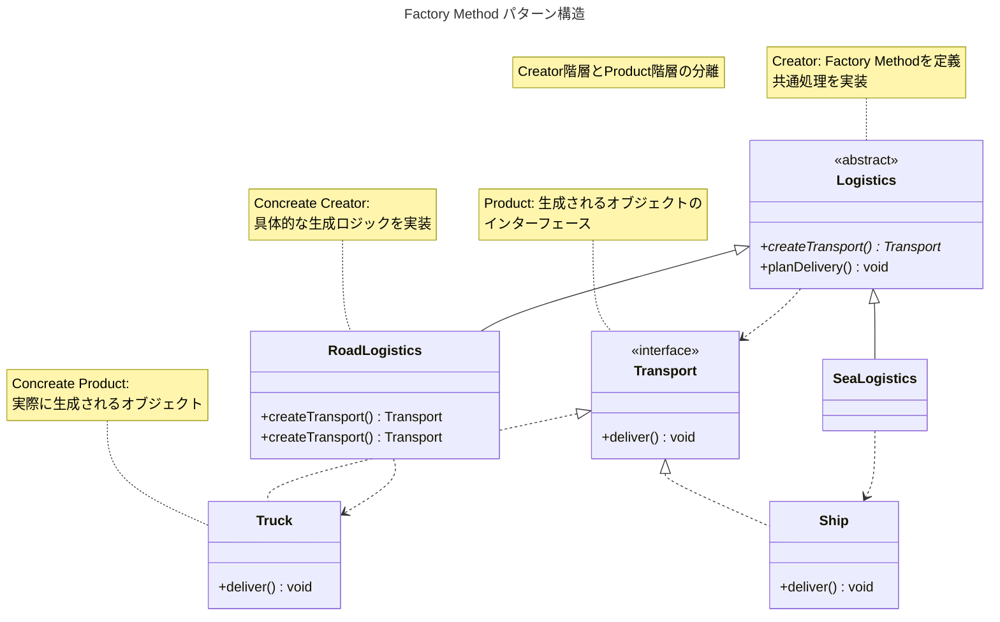
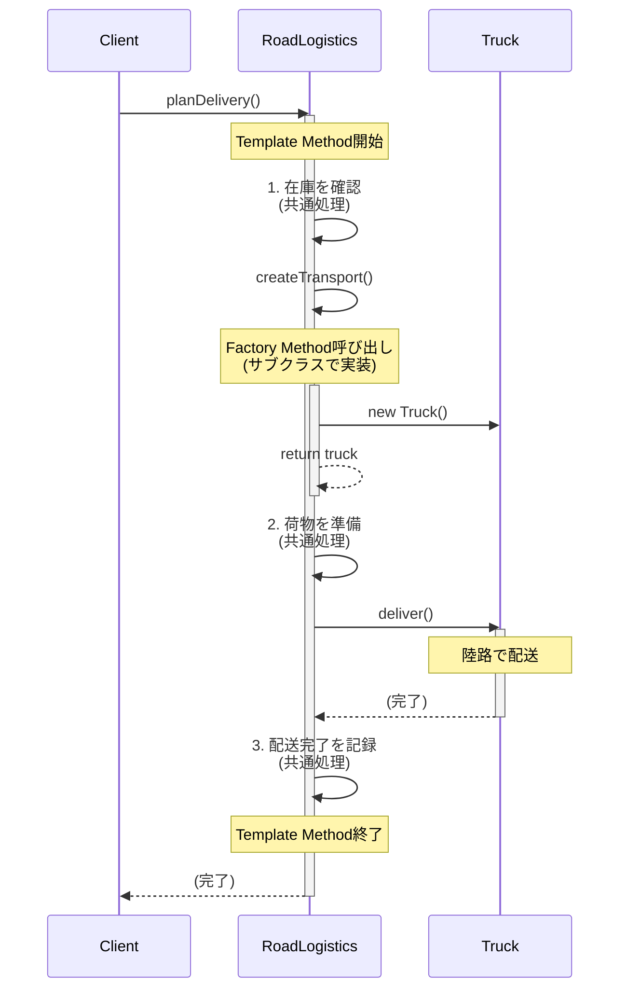
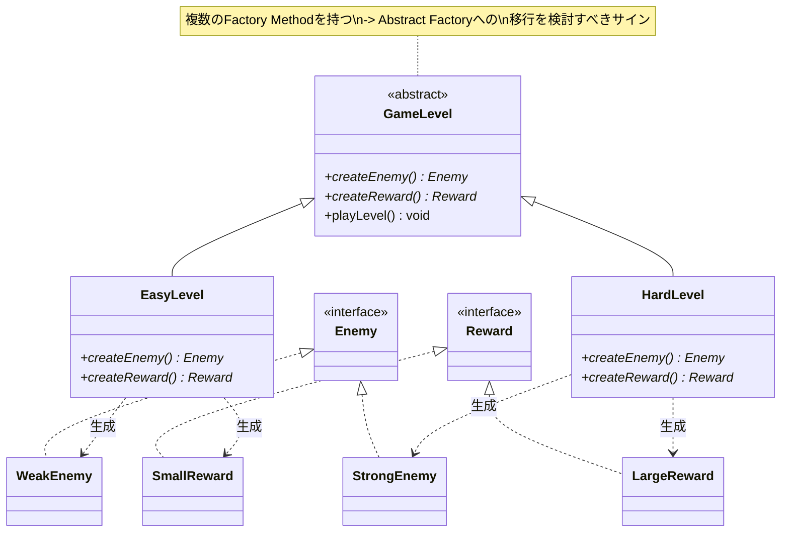

# Factory Methodパターンとは？

Factory Methodパターンはサブクラスにオブジェクト生成の責務を委譲する生成パターンです。

親クラスでオブジェクトを生成するインターフェースを定義し、具体的な生成ロジックはサブクラスが決定します。

これにより、コードを修正せずに新しいクラスを追加できる拡張性を実現しOpen-Close原則に準拠します。

```mermaid
flowchart TB
    parent["親クラス（Creator）<br/> 生成メソッドを定義<br/> 共通ロジックを実装"]
    child1["サブクラス<br/> 具体的な生成A"]
    child2["サブクラス<br/> 具体的な生成B"]

    parent -.->|"委譲"| child1
    parent -.->|"委譲"| child2

    style parent fill:#2d3748,stroke:#4a5568
    style child1 fill:#1a202c,stroke:#4a5568
    style child2 fill:#1a202c,stroke:#4a5568
```



## なぜFactory Methodが必要なのか

次の様な状況を考えて見ます。

> 「配送管理システムを開発しているが、現在は陸路配送のみ対応。将来的に海路、空路配送を追加する可能性がある。配送方法が増える度に既存コードを修正したくない」

この問題は、決済方法の追加、ログ出力先の切り替え、データベースドライバーの選択など、様々な場面で発生します。

### 問題のあるコード

Simple Facotryを使った実装では、新しいクラスを追加する度にFactoryを修正する必要があります。

```typescript
interface Transport {
  deliver(): void;
}

class Truck implements Transport {
  deliver() {
    console.log("陸路で配送します")
  }
}

class Ship implements Transport {
  deliver() {
    console.log("海路で配送します")
  }
}

// Simple Factory: 新しい配送方法を追加する度に修正が必要
class TransportFactory {
  static create(type: string): Transport {
    switch (type) {
      case "road":
        return new Truck();
      case "sea":
        return new Ship();

      // 空路を追加する場合、ここを修正する必要がある

      default:
        throw new Error(`Unknown type: ${type}`);
    }
  }
}

// クライアントコード
class LogisticsManager {
  planDelivery(type: string) {
    const transport = TransportFactory.create(type);
    transport.deliver();
  }
}
```

この例では次の問題があります。

- 新しい配送を追加する度に `TransportFactory` を修正する必要がある
- Open-Closed原則に違反(拡張に対して開いていない)
- テスト時に特定の配送方法だけをモックに差し替えにくい
- 配送方法ごとの初期化ロジックが複雑になるとFactoryが肥大化する

### Factory Methodパターンによる解決

サブクラスに生成の責務を委譲します。

```typescript
interface Transport {
  deliver(): void;
}

class Truck implements Transport {
  deliver() {
    console.log("陸路で配送します")
  }
}

class Ship implements Transport {
  deliver() {
    console.log("海路で配送します")
  }
}

// Creator: Factory Methodを定義
abstract class Logistics {
  // Factory Method: サブクラスが実践する
  abstract createTransport(): Transport;

  // Template Method: Factoryを使用するロジック
  planDelivery(): void {
    // 生成ロジックをサブクラスに委譲
    const transport = this.createTransport();

    // 共通の処理フロー
    console.log("配送を計画中...");
    transport.deliver();
    console.log("配送完了");
  }
}

// Concrete Creator: 陸路配送
class RoadLogistics extends Logistics {
  createTransport(): Transport {
    return new Truck();
  }
}

// Concrete Creator: 海路配送
class SeaLogistics extends Logistics {
  createTransport(): Transport {
    return new Ship();
  }
}

// 使用例
const roadLogistics = new RoadLogistics();
roadLogistics.planDelivery();
// Output:
// 配送を計画中...
// 陸路で配送します
// 配送完了

const seaLogistics = new SeaLogistics();
seaLogistics.planDelivery();
// Output:
// 配送を計画中...
// 海路で配送します
// 配送完了
```

この実装では次のことが改善されます。

- 新しい配送方法を追加する際、新しいサブクラスを作るだけで既存コードを修正しない
- Open-Closed原則に準拠（拡張に対して開き、修正に対して閉じる）
- 各配送方法ごとに独立したクラスで管理できる
- テスト時にサブクラス単位でモックに差し替えられる

### パターンの構造

Factory Methodパターンの基本構造を図で確認しましょう。



この構造により:

- **Creator(Logistics)**: Factory Methodを宣言し、共通処理フローを定義
- **Concrete Creator(RoadLogistics, SeaLogistics)**: Factory Methodを実装し、具体的なProductを生成
- **Product(Transport)**: 生成されるオブジェクトのインターフェース
- **Concrete Product(Truck, Ship)**: 実際に生成されるオブジェクト

💡 **本質**

Factory Methodパターンの本質は「オブジェクトを作る」ことではありません。

「生成の決定権をサブクラスに委譲し、親クラスを修正せずに拡張可能にすること」です。

## Template Methodパターンとの関係

Factory Methodは多くの場合 **Template Method** パターンと組み合わせて使われます。

```typescript
abstract class Logistics {
  // Factory Method
  abstract createTransport(): Transport;

  // Template Method: アルゴリズム骨格を定義
  planDelivery(): void {
    console.log("1. 在庫を確認");

    const transport = this.createTransport(); // Factory Methodを呼び出す

    console.log("2. 荷物を準備");
    transport.deliver();
    console.log("3. 配送完了を記録");
  }
}
```

この組み合わせにより:

- **Template Method**が処理フローの骨格を定義
- **Factory Method**が可変部分（オブジェクト生成）をサブクラスに委譲
- 共通処理とカスタマイズ可能な部分を分離



このシーケンス図から、Template Methodが処理の骨格を定義し、Factory Methodが可変部分をサブクラスに委譲している様子がわかります。

## いつ、どこで使うか?

Facotry Methodパターンは次のような場合に有効です。

| 使用場面 | 理由 |
| --- | --- |
| サブクラス毎に異なる生成ロジックが必要 | 各サブクラスで適切なオブジェクトを生成 |
| 将来的に新しい種類を追加する可能性が高い | 既存コードを修正せずに拡張可能 |
| フレームワークが生成をアプリに委譲したい | ライブラリ側は抽象クラスのみ提供 |
| テスト時に生成をモックに差し替えたい| サブクラス単位で差し替え可能 |

### 具体例

例1: プラグインシステム

```typescript
abstract class DocumentExporter {
  abstract createFormatter(): Formatter;

  export(document: Document): string {
    const formatter = this.createFormatter();
    return formatter.format(document);
  }
}

class PDFExporter extends DocumentExporter {
  createFormatter(): Formatter {
    return new PDFFormatter();
  }
}

class MarkdownExporter extends DocumentExporter {
  createFormatter(): Formatter {
    return new MarkdownFormatter();
  }
}
```

例2: フレームワーク設計

```typescript
// フレームワーク側: 抽象クラスのみ提供
class Warriorextends GameCharacter {
  createWeapon(): Weapon {
    return new Sword();
  }
}

class Archer extends GameCharacter {
  createWeapon(): Weapon {
    return new Bow();
  }
}
```

## いつ使わないか?

次の様な理由でFactory Methodを使うのは誤りです。

### 生成対象が少なく、増える見込みがない

```typescript
// ❌ 悪い例: 選択肢が2つだけで増える見込みがない
abstract class ReportGenerator {
  abstract createReport(): Report;

  generate(): void {
    const report = this.createReport();
    report.render();
  }
}

class PDFReportGenerator extends ReportGenerator {
  createReport(): Report {
    return new PDFReport();
  }
}

class ExcelReportGenerator extends ReportGenerator {
  createReport(): Report {
    return new ExcelReport();
  }
}
```

この使い方には次の問題があります。

- 選択肢が固定されているのに複雑な継承階層を作っている
- Simple Factoryで十分
- 過度な抽象化で可読性が低下

💡 原則

「将来増えるかもしれない」という推測だけでFactory Methodを使わないこと。

実際に拡張の必要性が出てから、Simple FactoryをFactory Methodにリファクタリングしても遅くありません。

### 単純な条件分岐で十分な場合

```typescript
// ❌ 過剰: 単純な条件分岐で済むのにFactory Methodを使う
abstract class Logger {
  abstract createOutput(): Output;

  log(message: string): void {
    const output = this.createOutput();
    output.write(message);
  }
}

// より良い方法: 単純な条件分岐またはDI
class Logger {
  constructor(private output: Output) {}

  log(message: string): void {
    this.output.write(message);
  }
}

// 使用時に注入
const logger = new Logger(new ConsoleOutput());
```

### 依存性注入(DI)で解決できる場合

```typescript
// ❌ 不要: Factory Methodを使う必要がない
abstract class OrderService {
  abstract createPaymentProcessor(): PaymentProcessor;

  processOrder(order: Order): void {
    const processor = this.createPaymentProcessor();
    processor.process(order);
  }
}

// ✅ 推奨: DIで注入
class OrderService {
  constructor(private paymentProcessor: PaymentProcessor) {}

  processOrder(order: Order): void {
    this.paymentProcessor.process(order);
  }
}
```

DIの利点:

- 継承不要
- テスト時のモック差し替えが容易
- 実行時に異なる実装を注入可能

## 使う場合の注意点

Factory Methodパターンを採用する場合でも、次のトレードオフを理解しておく必要があります。

### 継承階層が複雑になる

Factory Methodを使うと、クラス数が増加します。Simple Factoryと比較してみましょう。

```mermaid
---
title: Simple Factory vs Factory Method
---
flowchart TB
    subgraph fm["Factory Method (6クラス)"]
        direction TB
        FM_Creator["Logistics\n(abstract)"]
        FM_Road["RoadLogistics"]
        FM_Sea["SeaLogistics"]
        FM_Interface["Transport\n(interface)"]
        FM_Truck["Truck"]
        FM_Ship["Ship"]

        FM_Road ---|継承| FM_Creator
        FM_Sea ---|継承| FM_Creator
        FM_Road -.->|生成| FM_Truck
        FM_Sea -.->|生成| FM_Ship
        FM_Truck -.-|実装| FM_Interface
        FM_Ship -.-|実装| FM_Interface
    end

    subgraph sf["Simple Factory (4クラス)"]
        direction TB
        SF_Factory["TransportFactory\n(staticメソッド)"]
        SF_Interface["Transport\n(interface)"]
        SF_Truck["Truck"]
        SF_Ship["Ship"]

        SF_Factory -.->|生成| SF_Truck
        SF_Factory -.->|生成| SF_Ship
        SF_Truck -.-|実装| SF_Interface
        SF_Ship -.-|実装| SF_Interface
    end

    style sf fill:#1a202c,stroke:#4a5568
    style fm fill:#1a202c,stroke:#4a5568
    style SF_Factory fill:#2d3748,stroke:#4a5568
    style SF_Interface fill:#2d3748,stroke:#4a5568
    style SF_Truck fill:#2d3748,stroke:#4a5568
    style SF_Ship fill:#2d3748,stroke:#4a5568
    style FM_Creator fill:#2d3748,stroke:#4a5568
    style FM_Road fill:#2d3748,stroke:#4a5568
    style FM_Sea fill:#2d3748,stroke:#4a5568
    style FM_Interface fill:#2d3748,stroke:#4a5568
    style FM_Truck fill:#2d3748,stroke:#4a5568
    style FM_Ship fill:#2d3748,stroke:#4a5568
```



トレードオフ:

- Factory Methodの利点: 拡張性、Open-Closed原則準拠
- Factory Methodの欠点: クラス数増加、理解の難易度上昇

💡 判断基準

- 拡張頻度が高い -> Factory Method
- 拡張頻度が低い -> Simple Factory

### サブクラスの数だけ重複コードが発生する

各サブクラスで共通の処理が重複する可能性があります。

```typescript
// ❌ 悪い例: 初期化ロジックが各サブクラスで重複
class RoadLogistics extends Logistics {
  createTransport(): Transport {
    // 初期化処理が重複
    console.log("設定を読み込む");
    console.log("接続を確立");
    return new Truck();
  }
}

class SeaLogistics extends Logistics {
  createTransport(): Transport {
    // 同じ初期化処理が重複
    console.log("設定を読み込み");
    console.log("接続を確立");
    return new Ship();
  }
}
```

対策として共通処理を親クラスに抽出します。

```typescript
// ✅ 改善: 共通処理を親クラスに抽出
abstract class  Logistics {
  abstract createTransport(): Transport;

  planDelivery(): void {
    // 共通の初期化処理
    this.initialize();

    const transport = this.createTransport();
    transport.deliver();
  }

  private initialize(): void {
    console.log("設定を読み込み");
    console.log("接続を確立");
  }
}
```

### Factory Methodの命名規則

Factory Methodの命名は一貫性を保つことが重要です。

| 命名パターン | 例 | 備考 |
| --- | --- | --- |
| `create` + 名詞 | `createTransport()` | 最も一般的 |
| `make` + 名詞 | `makeConnection()` | 生成を強調 |
| `new` + 名詞 | `newInstance()` | Java風 |
| `build` + 名詞 | `buildQuery()` | 複雑な組み立てを示唆 |

💡 原則

プロジェクト内で命名パターンを統一すること。異なるパターンが混在すると可読性が低下します。

## 実装のバリエーション

Factory Methodを実装する場合、環境や要件に応じて複数の方法があります。

### デフォルト実装を提供する

抽象クラスでデフォルトの実装を提供し、必要に応じてオーバーライドする方法です。

```typescript
abstract class Logistics {
  // デフォルト実装を提供
  createTransport(): Transport {
    return new Truck(); // デフォルトは陸路配送
  }

  planDelivery(): void {
    const transport = this.createTransport();
    transport.deliver();
  }
}

// デフォルトを使う場合
class StandardLogistics extends Logistics {
  // createTransport()をオーバーライドしない
}

// カスタマイズする場合
class SeaLogistics extends Logistics {
  createTransport(): Transport {
    return new Ship(); // デフォルトを上書き
  }
}
```

この方法の利点:

- サブクラスが必ずしもFactory Methodを実装する必要がない
- デフォルトの動作を提供できる
- 段階的なカスタマイズが可能

### パラメータ化されたFactory Method

Factory Methodにパラメータを渡すことで、柔軟性を高めます。

```typescript
abstract class Logistics {
  abstract createTransport(type: string): Transport;

  planDelivery(type: string): void {
    const transport = this.createTransport(type);
    transport.deliver();
  }
}

class MultiModalLogistics extends Logistics {
  createTransport(type: string): Transport {
    switch (type) {
      case "express":
        return new ExpressTruck();
      case "standard":
        return new StandardTruck();
      default:
        throw new Error(`Unknown type: ${type}`);
    }
  }
}
```

注意点:

- パラメータ化しすぎるとSimple Factoryと変わらなくなる
- Factory Methodの本質(サブクラスへの委譲)が薄れる

### 複数のFactory Methodを持つ

1つのクラスに複数のFactory Methodを定義することも可能です。

```typescript
abstract class GameLevel {
  abstract createEnemy(): Enemy;
  abstract createReward(): Reward;

  playLevel(): void {
    const enemy = this.createEnemy();
    const reward = this.createReward();

    enemy.attack();
    console.log("敵を倒しました");
    reward.give();
  }
}

class EasyLevel extends GameLevel {
  createEnemy(): Enemy {
    return new WeakEnemy();
  }

  createReward(): Reward {
    return new SmallReward();
  }
}

class HardLevel extends GameLevel {
  createEnemy(): Enemy {
    return new StrongEnemy();
  }

  createReward(): Reward {
    return new LargeReward();
  }
}
```

複数のFactory Methodを持つパターンの構造:



この場合、**Abstract Factoryパターン**への移行を検討すべきタイミングかもしれません。

## 代替手段

Factory Methodパターンの代わりに、以下のパターンやアプローチを検討すべきです。

### 依存性注入(Dependency Injection)

DIコンテナを使うことで、継承なしで柔軟性を実現できます。

利点:

- 継承階層が不要
- テスト時のモック差し替えが容易
- 実行時に異なる実装を注入可能

```typescript
// Factory Methodを使わずDIで解決
class Logistics {
  constructor(private transport: Transport) {}

  planDelivery(): void {
    this.transport.deliver();
  }
}

// 使用時に注入
const roadLogistics = new Logistics(new Truck());
const seaLogistics = new Logistics(new Ship());
```

### Strategyパターン

生成よりも動作の切り替えが主目的なら、Strategyパターンの方が適切です。

利点:

- 実行時にアルゴリズムを切り替え可能
- 生成ロジックより動作ロジックに焦点
- 継承不要

```typescript
interface DeliveryStrategy {
  deliver(): void
}

class Logistics {
  constructor(private strategy: DeliveryStrategy) {}

  setStrategy(strategy: DeliveryStrategy): void {
    this.strategy = strategy;
  }

  planDelivery(): void {
    this.strategy.deliver();
  }
}
```

### Prototypeパターン

既存のインスタンスをクローンする場合、Prototypeパターンが適切です。

利点:

- 複雑な初期化処理を避けられる
- 実行時にクラスを指定できる

### Simple Factory

拡張頻度が低く、生成ロジックが単純ならSimple Factoryで十分です。

利点:

- 実装がシンプル
- 理解しやすい
- クラス数が少ない

## まとめ

Factory Methodパターンは「サブクラスにオブジェクト生成の責務を委譲する生成パターン」です。

💡 重要なポイント

1. **拡張性を重視する** - 新しいクラスを追加する際、既存コードを修正せずに済む
2. **Open-Closed原則に準拠** - 拡張に対して開き、修正に対して閉じる
3. **継承階層のトレードオフを理解** - クラス数が増えることを受け入れる
4. **Simple Factoryからの段階的移行** - 最初はSimple Factoryで十分です。拡張の必要性が出たら移行

Factory Methodは強力なパターンですが、全ての生成に使う必要性はありません。

「本当に拡張性が必要か」「DIやStrategyパターンで解決できないか」を常に検討すべきです。

### 関連パターン

- **Abstract Factory** - 複数の関連オブジェクトを生成する場合に使用
- **Template Method** - Factory Methodと組み合わせて処理フローを定義
- **Prototype** - インスタンスのクローンで生成する代替手段
- **Strategy** - 生成ではなく動作の切り替えが目的の場合に使用
