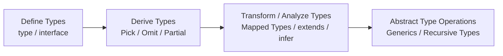

# How to Choose the Right TypeScript Type System Features

TypeScript provides many features for working with types, including `interface`, `type`, `Pick`, `Omit`, `infer`, `extends`, [Mapped Types](https://www.typescriptlang.org/docs/handbook/2/mapped-types.html), and [Conditional Types](https://www.typescriptlang.org/docs/handbook/2/conditional-types.html).

As you learn these features, a natural question comes up:

> "I understand what they can do, but when should I use each one?"

In particular, `infer` and `extends` can perform fairly complex operations at the type level, which can make them tempting to use whenever they seem useful.

However, the important question in type design is not **"What can this feature do?"**, but **"What level of the problem am I trying to solve?"**

This article organizes TypeScript's type system from **concrete to abstract**.

It also separates problems that can be solved with types from problems that require runtime validation, and uses that distinction to clarify when to use TypeScript and Zod.

---

## Abstraction Levels in Type Design

The way types are used generally moves from defining concrete concepts, to deriving types from existing ones, to transforming and analyzing type structures, and finally to abstracting type operations themselves.



The more concrete the concept, the further left it is. The more generalized the type operation, the further right it is.

This diagram is a **rough guide to the level of abstraction and complexity in type design**.

It does not mean that implementation must always proceed from left to right.

---

## Define Types

When a new concept appears, start by defining the concept itself with `interface` or `type`.

For example, a profile for a blog might look like this:

```ts
type CareerHistory = {
  period: string;
  title: string;
  achievement: string;
};

type Profile = {
  introduction: string;
  careerHistory: CareerHistory[];
};
```

Here, `CareerHistory` and `Profile` are two separate concepts.

There is no need to transform an existing type yet.

### interface and type

`interface` is well suited to defining the structure or contract of an object.

```ts
interface User {
  id: string;
  name: string;
}
```

`type`, on the other hand, can represent a wider range of types, including Union Types and Literal Types.

```ts
type UserId = string;

type Status = "active" | "inactive";

type Result =
  | { success: true; data: User }
  | { success: false; error: Error };
```

The actual choice also depends on the conventions of the project.

The important point here is that this is the stage where a **new concept is defined**.

### Single Source of Truth

When defining types, it is also important to avoid writing the same type information in multiple places.

For example, defining similar structures independently creates no relationship between the types.

```ts
type Profile = {
  introduction: string;
  careerHistory: CareerHistory[];
  skills: Skill[];
};

type ProfileSummary = {
  introduction: string;
  skills: Skill[];
};
```

If `Profile` changes, `ProfileSummary` does not automatically follow.

In this case, the relationship can be maintained by deriving the type from the existing one.

```ts
type ProfileSummary = Pick<
  Profile,
  "introduction" | "skills"
>;
```

This creates a relationship such as:

```text
Profile
  ├── ProfileSummary
  ├── ProfileWithoutCareer
  └── ...
```

This is the idea of Single Source of Truth in type design.

However, SSOT does not mean that every type should be derived from one large base type.

For example:

```ts
type CareerHistory = {
  period: string;
  title: string;
  achievement: string;
};

type Profile = {
  introduction: string;
  careerHistory: CareerHistory[];
};
```

`CareerHistory` is an independent domain concept.

It is therefore more natural to define it independently.

There is no need to force it into something like:

```ts
type CareerHistory =
  Profile["careerHistory"][number];
```

**Independent concepts should be defined independently. Derived concepts should be generated from the types they are derived from.**

That distinction is important.

---

## Derive Types

When creating a new type by reusing part of an existing type, use type operations.

For example:

```ts
type Profile = {
  introduction: string;
  careerHistory: CareerHistory[];
  skills: Skill[];
};
```

To create a profile summary:

```ts
type ProfileSummary = Pick<
  Profile,
  "introduction" | "skills"
>;
```

To exclude a specific property, use `Omit`.

```ts
type ProfileWithoutCareer =
  Omit<Profile, "careerHistory">;
```

Other common utilities include:

```ts
Partial<Profile>
Readonly<Profile>
Required<Profile>
```

The purpose at this stage is to create another type **while maintaining its relationship with the existing type**.

### Common Type Operations

* `Pick`: Extract specific properties
* `Omit`: Exclude specific properties
* `Partial`: Make all properties optional
* `Required`: Make all properties required
* `Readonly`: Make all properties readonly
* `keyof`: Obtain property names as a Union Type
* `T[K]`: Obtain the type of a specific property

The important distinction is whether you are creating a **new concept** or simply creating another representation of an existing concept.

If it is the latter, first consider whether you can preserve the relationship with the existing type.

---

## Transform and Analyze Types

There are requirements that cannot be expressed with `Pick` or `Omit` alone.

For example:

> "Make every property nullable."

```ts
type Nullable<T> = {
  [K in keyof T]: T[K] | null;
};
```

```ts
type NullableProfile = Nullable<Profile>;
```

This does more than select properties.

It performs a process like:

```text
Profile
  ↓
Iterate over each property
  ↓
Transform each property type
  ↓
Generate a new type
```

This is a type transformation using a Mapped Type.

### extends and Conditional Types

`extends` can be combined with Conditional Types to express conditions based on types.

```ts
type IsString<T> =
  T extends string
    ? true
    : false;
```

```ts
type A = IsString<string>;
// true

type B = IsString<number>;
// false
```

This is similar to an if statement at the type level.

```text
Is T a string?
  ├─ Yes → true
  └─ No  → false
```

A useful rule for `extends` is:

**Use it when the generated type should change depending on the input type.**

### infer

`infer` is useful when extracting type information from inside another type.

```ts
type Unwrap<T> =
  T extends Promise<infer U>
    ? U
    : T;
```

```ts
type Result = Unwrap<Promise<string>>;
// string
```

Here, the `string` inside `Promise<string>` is extracted.

```text
Promise<string>
      ↓
   infer U
      ↓
   U = string
      ↓
    string
```

The key reason to use `infer` is:

**Use it when you need to analyze a type's structure and extract type information from it.**

For example, if you only need the element type of a specific array, this is enough:

```ts
type CareerHistoryItem =
  Profile["careerHistory"][number];
```

There is no need to introduce `infer`.

On the other hand, if you want a generic type that extracts the element type from arbitrary arrays:

```ts
type ArrayItem<T> =
  T extends readonly (infer U)[]
    ? U
    : never;
```

then `infer` becomes useful.

The goal is not to use an advanced feature. The goal is to **extract the type information you need**.

---

## Abstract Type Operations

As type operations become more generic, they move further away from specific domain models.

For example:

```ts
type ArrayItem<T> =
  T extends readonly (infer U)[]
    ? U
    : never;
```

This type is not specific to `CareerHistory`.

It can be used with any array:

```ts
ArrayItem<string[]>
ArrayItem<number[]>
ArrayItem<CareerHistory[]>
```

At this stage, the focus shifts from:

> "How should this data be represented?"

to:

> "How should types themselves be transformed?"

```text
Concrete
  ↓
Profile
  ↓
Pick<Profile, ...>
  ↓
Nullable<Profile>
  ↓
Nullable<T>
  ↓
ArrayItem<T>
  ↓
Abstract
```

### Generic Type Abstraction

Generics are important when abstracting type operations.

```ts
type Nullable<T> = {
  [K in keyof T]: T[K] | null;
};
```

`T` is not a specific type.

The same transformation can be applied to any type.

### Recursive Types and Advanced Type-Level Programming

Combining type operations makes increasingly complex type transformations possible.

```text
Generics
  +
Conditional Types
  +
Mapped Types
  +
infer
  +
Recursive Types
```

By combining these features, TypeScript's type system becomes highly expressive.

This type-level computational capability is also related to the fact that TypeScript's type system is considered Turing complete.

However, **"TypeScript is Turing complete" does not mean that `infer` or `extends` themselves are Turing complete.**

`infer` and `extends` are individual features used to construct type-level computations.

And the fact that complex things can be expressed at the type level does not mean that complex types should be written.

---

## Another Axis: Compile Time vs. Runtime

Everything so far has been about:

> **"If the problem should be solved with types, how much abstraction is appropriate?"**

There is another question:

> **"Can this problem actually be solved at the type level?"**

TypeScript's type system primarily operates at compile time.

```text
TypeScript
    ↓
Compile Time
    ↓
Type Checking
    ↓
JavaScript
    ↓
Runtime
```

For example, consider React props:

```ts
type ButtonProps = {
  variant: "primary" | "secondary";
  disabled?: boolean;
};
```

```tsx
<Button variant="primary" />
<Button variant="foo" />
//              ^^^
//              TypeScript error
```

This problem can be solved at compile time.

However, some data cannot be known until runtime.

This is where TypeScript and Zod have different roles.

---

## Runtime Data Cannot Be Validated by TypeScript Alone

Consider data fetched from an API.

```ts
const data = await fetch("/api/profile")
  .then(res => res.json());
```

TypeScript alone cannot guarantee that `data` actually has the expected structure.

TypeScript knows the types specified in the source code.

It cannot validate the actual value returned by an API at runtime.

In other words:

```text
"This should have this shape"
        ↓
TypeScript
        ↓
No problem at compile time
```

and:

```text
"This value actually has this shape"
        ↓
Runtime
        ↓
Validate the data
```

are different problems.

**"Expected to be correct" and "actually verified to be correct" are not the same thing.**

---

## Runtime Validation with Zod

For data received at runtime, a library such as Zod can be used for Runtime Validation.

```ts
const UserSchema = z.object({
  id: z.string(),
  name: z.string(),
});
```

```ts
const result = UserSchema.safeParse(data);
```

The flow becomes:

```text
API
 ↓
External Data
 ↓
Zod
 ↓
Runtime Validation
 ↓
Validated Data
 ↓
Application
```

### The Roles of Zod and TypeScript

|                            | TypeScript | Zod |
| -------------------------- | ---------- | --- |
| Compile-time type checking | ◎          | △   |
| Runtime validation         | ×          | ◎   |
| IDE completion             | ◎          | ○   |
| Internal application types | ◎          | △   |
| External data validation   | ×          | ◎   |
| Runtime cost               | None       | Yes |

TypeScript checks:

> "Is this code using types correctly?"

Zod checks:

> "Does this actual runtime value have the expected structure?"

They are not competing tools. Their roles are different.

### When to Use Zod

The deciding factor is not whether the data is static content.

The important question is:

> **Can the correctness of this value be guaranteed at compile time by TypeScript?**

If yes, TypeScript is usually sufficient.

Examples include:

```text
React Props
Internal application data
TypeScript-defined constants
Static content
```

On the other hand, data whose actual value is not known until runtime should be considered for Runtime Validation.

Examples include:

```text
API responses
Database data
CMS data
JSON
localStorage
URL parameters
User input
Data from external libraries
```

For these types of data, adding a TypeScript type does not guarantee that the actual runtime value matches that type.

### Using Zod as the SSOT

Zod can also generate TypeScript types from a schema.

```ts
const ProfileSchema = z.object({
  introduction: z.string(),
  careerHistory: z.array(
    z.object({
      period: z.string(),
      title: z.string(),
      achievement: z.string(),
    })
  ),
});

type Profile = z.infer<typeof ProfileSchema>;
```

This gives us:

```text
ProfileSchema
    │
    ├── Runtime
    │     Validate actual data
    │
    └── Compile Time
          Generate Profile type
```

The Zod schema becomes the SSOT for both Runtime Validation and the TypeScript type.

This avoids maintaining the same definition twice:

```ts
// Schema
id: z.string()

// Type
id: string
```

---

## A Decision Flow Including TypeScript and Runtime Validation

There are two different axes to consider.

### Abstraction Within the Type System

```text
Concrete
  ↓
Define Types
  ↓
Derive Types
  ↓
Transform / Analyze Types
  ↓
Abstract Type Operations
  ↓
Abstract
```

The question here is:

> **"If I am solving this with types, how much type-level abstraction do I actually need?"**

### Compile Time vs. Runtime

```text
Can this value be guaranteed at compile time?
        │
   ┌────┴────┐
  Yes       No
   │          │
TypeScript   Zod, etc.
   │          │
Compile      Runtime
Time         Validation
```

The question here is:

> **"Can TypeScript's type system actually guarantee this value?"**

These are separate axes.

---

## Summary

TypeScript provides many features for working with types.

Knowing what a feature can do and knowing when to use it are different things.

In type design, start by defining new concepts with `interface` or `type`.

When creating another representation from an existing type, use `Pick`, `Omit`, and similar utilities to maintain the relationship with the original type.

When that is not enough and the type structure itself needs to be transformed or analyzed, use Mapped Types, Conditional Types, `extends`, `infer`, and similar features.

When type operations themselves need to be generalized, Generics, Recursive Types, and other advanced techniques become useful.

```text
Concrete
  ↓
Define Types
  ↓
Derive Types
  ↓
Transform / Analyze Types
  ↓
Abstract Type Operations
  ↓
Abstract
```

However, one more question should be asked:

> **"Is this actually a problem that should be solved at compile time?"**

For data such as API responses and user input, the actual value cannot be known until runtime.

In those cases, TypeScript's types alone are not enough. Use Zod or another Runtime Validation solution, and generate TypeScript types from the schema when appropriate.

Ultimately:

> **Choose the simplest mechanism that provides the required guarantee.**

That is the basic principle for choosing how to use TypeScript's type system.
