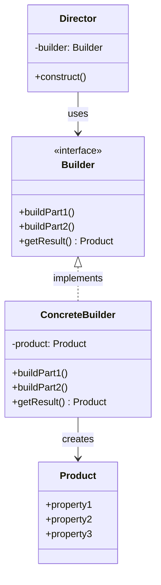

# What is the Builder Pattern?

The Builder pattern is a creational pattern that separates the construction of a complex object from its representation, 
allowing the same construction process to create different representations.

## Why is Builder Needed?

Consider the following situation:

> "I need to implement a report generation feature. I want to output the same data in 3 formats: HTML, Markdown, and plain text.
> The construction procedure is the same, but I want to swap only the output format."

### Problematic Code

Duplicating construction logic for each output format requires modifying all formats when the procedure changes.

```typescript
// Construction logic duplicated for each format
function buildHtmlReport(data: ReportData): string {
  let html = "<h1>" + data.title + "</h1>";
  html += "<p>" + data.summary + "</p>";

  for (const item of data.items) {
    html += "<li>" + item + "</li>";
  }

  return html;
}

function buildMarkdownReport(data: ReportData): string {
  let md = "# " + data.title + "\n";
  md += data.summary + "\n";

  for (const item of data.items) {
    md += "- " + item + "\n";
  }

  return md;
}

// When procedure changes, all function need modification
```

This example has the following problems:

- Construction procedure is duplicated in each function
- Adding a new format requires reimplementing the same procedure
- Procedure changes require modifying all formats

### Solution with Builder Pattern

**Director** manages the construction procedure, and **Builder** handles the representations method for each format.

```typescript
// Builder: Defines how to construct each part
interface ReportBuilder {
  addTitle(title: string): void;
  addSummary(summary: string): void;
  addItem(item: string): void;
  getResult(): void;
}

// ConcreteBuilder: HTML format
class HtmlReportBuilder implements ReportBuilder {
  private result = "";
  
  addTitle(title: string): void {
    this.result += `<h1>${title}</h1>`;
  }

  addSummary(summary: string): void {
    this.result += `<p>${summary}</p>`;
  }

  addItem(item: string): void {
    this.result += `<li>${item}</li>`;
  }

  getResult(): string {
    return this.result;
  }
}

// ConcreteBuilder: Markdown format
class MarkdownReportBuilder implements ReportBuilder {
  private result = "";
  
  addTitle(title: string): void {
    this.result += `# ${title}\n`;
  }

  addSummary(summary: string): void {
    this.result += `${summary}\n\n`;
  }

  addItem(item: string): void {
    this.result += `- ${item}\n`;
  }

  getResult(): string {
    return this.result;
  }
}

// Director: Manages construction procedure (what to build in what order)
class ReportDirector {
  constructor(builder: ReportBuilder, data: ReportData): void {
    builder.addTitle(data.title);
    builder.addSummary(data.summary);
    for (const item of data.items) {
      builder.addItem(item);
    }
  }
}

// Usage: Generate different formats with the same Director
const director = new ReportDirector();
const data = { title: "Monthly Report", summary: "Summary...", items: ["Item 1", "Item 2"] };

const htmlBuilder = new HtmlReportBuilder();
director.constructor(htmlBuilder, data);
console.log(htmlBuilder.getResult()); // HTML format

const mdBuilder = new MarkdownReportBuilder();
director.constructor(mdBuilder, data);
console.log(mdBuilder.getResult()); // Markdown format
```

This implementation improves the following:

- Construction procedure is centralized in Director
- Adding a new format only requires adding a Builder implementation
- Procedure changes in Director are reflected in all formats

💡 **Essence**

The essence of the Builder pattern is not "using method chaining".

It is **"separating the construction procedure (Director) from the representation method (Builder), enabling different outputs from the same procedure"**.

## Structure of Builder Pattern



## When to Use?

The Builder pattern is effective in the following cases:

| Use Case | Reason |
| --- | --- |
| Want to create different representations with same procedure | Just swap Builder to change output format |
| Complex procedure that needs reuse | centralized procedure in Director, share across fromats |
| Want to control construction process step by step | Each step is explicitly separated |

### Example: Document Builder

```typescript
// Generate PDF and HTML with the same construction procedure
interface DocumentBuilder {
  addHeading(text: string): void;
  addParagraph(text: string): void;
  addImage(url: string): void;
  getResult(): unknown;
}

class PdfDocumentBuilder implements DocumentBuilder {
  addHeading(text: string): void { /* Add PDF heading */}
  addParagraph(text: string): void { /* Add PDF paragraph */}
  addImage(url: string): void { /* Add PDF image */}
  getResult(): PdfDocument { return this.pdf; }
}

class HtmlDocumentBuilder implements DocumentBuilder {
  addHeading(text: string): void { /* Add HTML heading */}
  addParagraph(text: string): void { /* Add HTML paragraph */}
  addImage(url: string): void { /* Add HTML Image */}
  getResult(): string { return this.html; }
}

// Director executes same procedure, swap Builder for different formats
```

## When Not to Use?

The Builder pattern is overkill in the following cases:

### When There's Only One Output Format

```typescript
// ❌ overkill: Director/Builder separation unnecessary for single format
class SingleFormatDirector {...}
class SingleFormatBuilder {...}
```

If format swapping is unnecessary, direct construction is simpler.

### When Construction Procedure is Simple

```typescript
// ❌ Overkill: Builder pattern unnecessary for simple construction
class PointBuilder {
  setX(x: number): this {...}
  setY(y: number): this {...}
}
```

A regular constructor `new Point(x, y)` is sufficient.

💡 **Decision Criteria**

- Multiple representations + common procedure: BUilder pattern
- Single representation or simple construction: Direct construction

## Cautions When Using

When adopting the Builder pattern, understand these 3 cautions:

### 1. Increased Number of Classes

director, Builder (interface), ConcreteBuilder (each format) - at least 3+ classes are needed.

### 2. Builder Interface Design is Critical

You need to design the interface at an appropriate granularity that all ConcreteBuilders can implements.

### 3. Handling Different Product Types

When each Builder returns a different type of Product, careful design of `getResult()` return type is needed.

## Summary

The Builder pattern is a pattern for "separating construction procedure from representation method, enabling different outputs from the same procedure".

💡 **Key Point**

- **Separation of procedure and representation** - Director handles procedure, Builder handles representation
- **Format swapping** - Just change BUilder to change output format
- **Procedure reuse** - Share same Director across multiple Builders

If there's only one output format, or construction is simple, direct construction is simpler.

### Modern Simplification (Fluent Builder)

In practice, **Fluent Builder** that omits Director is commonly used.
It builds step by step with method chaining and generates with `build()`.

The main purpose is "solving telescoping constructor problem" rather than GoF's "generating different representations".

```typescript
// Fluent Builder: No Director, build with method chaining
const user = new UserBuilder();
  .setName("Alice")
  .setEmail("alice@example.com")
  .build()
```
