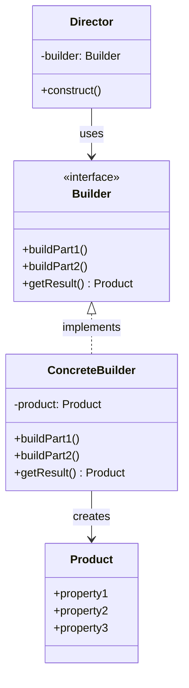

# Builderパターンとは?

Builderパターンは複雑なオブジェクトの構築を表現から分離し、同じ構築プロセスで異なる表現を作成できる様にする生成パターンです。

構築の「手順」と「方法」を分離することで同じ手順から異なる成果物を生成できます。

## なぜBuilderが必要なのか

次のような状況を考えてみます。

> レポート生成機能を実装したい。
> 同じデータから、HTML形式、Markdown形式、プレーンテキスト形式の3種類を出力したい。
> 構築手順は同じだが出力形式だけ差し替えたい。

### 問題のあるコード

出力形式毎に構築ロジックを重複させると手順の変更時に全形式を修正する必要があります。

```typescript
// 各形式で構築ロジックが重複
function buildHtmlReport(data: ReportData): string {
  let html = "<h1>" + data.title + "</h1>";
  html += "<p>" + data.summary + "</p>";

  for (const item of data.items) {
    html += "<li>" + item + "</li>";
  }

  return html;
}

function buildMarkdownReport(data: ReportData): string {
  let md = "# " + data.title + "\n";
  md += data.summary + "\n";

  for (const item of data.items) {
    md += "- " + item + "\n";
  }

  return md;
}

// 構築手順の変更時、全関数を修正する必要がある
```

この例では次の問題があります。

- 構築手順が各関数に重複している
- 新しい形式を追加する度に同じ手順を再実装する必要がある
- 手順の変更時に全形式を修正する必要がある

### Builderパターンによる解決

Directorが構築手順を管理し、Builderが各形式の表現方法を担当します。

```typescript
// Builder: 各部分をどのように構築するかを定義
interface ReportBuilder {
  addTitle(title: string): void;
  addSummary(summary: string): void;
  addItem(item: string): void;
  getResult(): void;
}

// ConcreteBuilder: HTML形式
class HtmlReportBuilder implements ReportBuilder {
  private result = "";
  
  addTitle(title: string): void {
    this.result += `<h1>${title}</h1>`;
  }

  addSummary(summary: string): void {
    this.result += `<p>${summary}</p>`;
  }

  addItem(item: string): void {
    this.result += `<li>${item}</li>`;
  }

  getResult(): string {
    return this.result;
  }
}

// ConcreteBuilder: Markdown形式
class MarkdownReportBuilder implements ReportBuilder {
  private result = "";
  
  addTitle(title: string): void {
    this.result += `# ${title}\n`;
  }

  addSummary(summary: string): void {
    this.result += `${summary}\n\n`;
  }

  addItem(item: string): void {
    this.result += `- ${item}\n`;
  }

  getResult(): string {
    return this.result;
  }
}

// Director: 構築手順を管理（どの順序で何を構築するか）
class ReportDirector {
  constructor(builder: ReportBuilder, data: ReportData): void {
    builder.addTitle(data.title);
    builder.addSummary(data.summary);
    for (const item of data.items) {
      builder.addItem(item);
    }
  }
}

// 使用例: 同じDirectorで異なる形式を生成
const director = new ReportDirector();
const data = { title: "月次報告", summary: "概要...", items: ["項目1", "項目2"] };

const htmlBuilder = new HtmlReportBuilder();
director.constructor(htmlBuilder, data);
console.log(htmlBuilder.getResult()); // HTML形式

const mdBuilder = new MarkdownReportBuilder();
director.constructor(mdBuilder, data);
console.log(mdBuilder.getResult()); // Markdown形式
```

この実装では次のことが改善されます。

- 構築手順がDirectorに一元管理される
- 新形式の追加はBuilderの実装を追加するだけ
- 手順の変更はDirectorのみ修正すれば全形式に反映

💡 **本質**
Builderパターンの本質は「メソッドチェーンを使うこと」ではありません。

「構築の手順（Director）と表現の方法（Builder）を分離し、同じ手順で異なる成果物を作れるようにする」ことです。

## Builderパターンの構造



## いつ使うか?

Builderパターンは次の様な場合に有効です。

| 使用場面 | 理由 |
| --- | --- |
| 同じ構築手順で異なる表現を作成したい | Builderを差し替えるだけで出力形式を変更 |
| 構築手順が複雑で再利用したい| Directorに手順を集約し、各形式で共有 |
| 構築プロセスを段階的に制御したい| 各ステップを明示的に分離できる |

### 具体例: ドキュメントビルダー

```typescript
// 同じ構築手順でPDFとHTMLを生成
interface DocumentBuilder {
  addHeading(text: string): void;
  addParagraph(text: string): void;
  addImage(url: string): void;
  getResult(): unknown;
}

class PdfDocumentBuilder implements DocumentBuilder {
  addHeading(text: string): void { /* PDF用の見出し追加 */}
  addParagraph(text: string): void { /* PDF用の段落追加 */}
  addImage(url: string): void { /* PDF用の画像追加 */}
  getResult(): PdfDocument { return this.pdf; }
}

class HtmlDocumentBuilder implements DocumentBuilder {
  addHeading(text: string): void { /* HTML用の見出し追加 */}
  addParagraph(text: string): void { /* HTML用の段落追加 */}
  addImage(url: string): void { /* HTML用の画像追加 */}
  getResult(): string { return this.html; }
}

// Directorが同じ手順を実行、Builderを差し替えて異なる形式を生成
```

## いつ使わないか?

次の様な場合はBuilderパターンは過剰です。

### 出力形式が1つだけの場合

```typescript
// ❌ 過剰: 形式が1つならDirector/Builderの分離は不要
class SingleFormatDirector {...}
class SingleFormatBuilder {...}
```

形式の差し替えが不要なら直接構築する方がシンプルです。

### 構築手順が単純な場合

```typescript
// ❌ 過剰: 単純な構築にBuilderパターンは不要
class PointBuilder {
  setX(x: number): this {...}
  setY(y: number): this {...}
}
```

通常のコンストラクタ `new Point(x, y)` で十分です。

💡 **判断基準**

- 複数の表現 + 共通の構築手順: Builderパターン
- 単一の表現 or 単純な構築: 直接構築

## 使う場合の注意点

Builderパターンを採用する場合、次の3つの注意点を理解しておく必要があります。

### 1. クラス数が増加する

Director、Builder（インターフェース）、ConcreteBuilder（各形式）と最低でも3つ以上のクラスが必要になります。

### 2. Builderインターフェースの設計が重要

全てのConcreteBuilderが実装できる適切な粒度でインターフェースを設計する必要があります。

### 3. Productの型が異なる場合の扱い

各Builderが異なる型のProductを返す場合、`getResult()` の戻り値の型設計に注意が必要です。

## まとめ

Builderパターンは「構築の手順と表現の方法を分離し、同じ手順で異なる成果物を作れる様にする」パターンです。

💡 **Point**

- **手順と表現の分離** - Directorが手順、BUilderが表現を担当
- **形式の差し替え** - Builderを変えるだけで出力形式を変更
- **手順の再利用** - 同じDirectorを複数のBuilderで共有

出力形式が1つだけ、または構築が単純な場合は直接構築する方がシンプルです。

### 現代での簡略化（Fluent Builder）

実務ではDirectorを省略した**Fluent Builder**がよく使われます。
メソッドチェーンで段階的に構築し、`build()` で生成するパターンです。

GoFの「異なる表現の生成」ではなく「テレスコーピングコンストラクタ問題の解決」が主目的となります。

```typescript
// Fluent Builder: Directorなし、メソッドチェーンで構築
const user = new UserBuilder();
  .setName("Alice")
  .setEmail("alice@example.com")
  .build()
```
